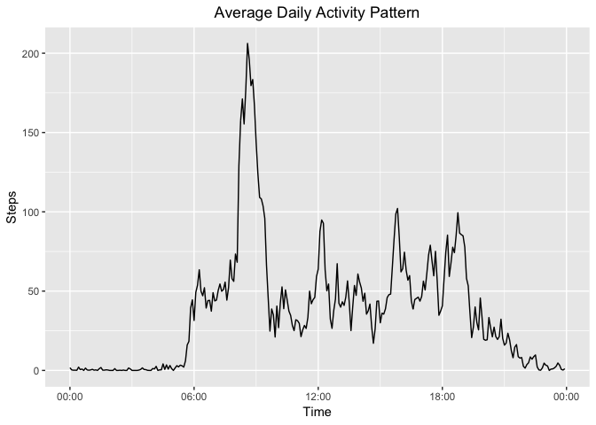

<style type="text/css">
.table {

    width: 40%;

}
</style>

## Loading and preprocessing the data  
Read the data from csv  

```r
activity <- read.csv("activity.csv")
```
Convert date column from character to Date

```r
activity$date <- as.Date(activity$date)
```

## Steps taken per day

Get total steps per day and a histogram of the steps variable

```r
library(dplyr)
```

```
## 
## Attaching package: 'dplyr'
```

```
## The following objects are masked from 'package:stats':
## 
##     filter, lag
```

```
## The following objects are masked from 'package:base':
## 
##     intersect, setdiff, setequal, union
```

```r
sum_by_day <- activity %>% group_by(date) %>% summarise_at(vars(1), funs(sum(., na.rm=TRUE)))
hist(sum_by_day$steps)
```

<!-- -->

Get mean and median  

```r
mean_s <- mean(sum_by_day$steps)
median_s <- median(sum_by_day$steps)
```

Mean steps per day : 9354.2  
Median steps per day :  10395

## Average daily activity pattern

Get the mean steps by interval  

```r
library(ggplot2)
library(scales)
mean_by_interval <- activity %>% group_by(interval) %>% summarise_at(vars(1), funs(mean(., na.rm=TRUE)))  
```

Add a time column of class POSIXct

```r
mean_by_interval$time <- as.POSIXct( "1970-01-01", tz = "CET" ) + as.difftime( floor(mean_by_interval$interval/100)*60+mean_by_interval$interval %% 100, units="mins"
)
```
Note: 1970 date is not important we will just use the time of day  


```r
ggplot(mean_by_interval, aes(x=time, y=steps)) +
  geom_line() +
  scale_x_datetime(name = "Time", date_labels = "%H:%M")+
  scale_y_continuous(name="Steps")+
  ggtitle("Average Daily Activity Pattern") +
  theme(plot.title = element_text(hjust = 0.5))
```

<!-- -->

```r
the_max <- mean_by_interval[which.max(mean_by_interval$steps),]
```

The 5 minutes interval which on average has more steps is 835 with 206.1698113 steps average, and corresponds to 08:35 in the morning

## Imputing missing values

Get number of NAs   

```r
nas <- sum(is.na(activity$steps))
```

Number of NA values : 2304  


Get a dataframe with NAs filled with the steps mean for that 5 minutes interval

```r
activity_p <- activity

the_na_rows <- which(is.na(activity_p$steps))
for (i in the_na_rows){
  its_interval <- activity_p[i,]$interval
  activity_p[i,]$steps <- mean_by_interval[mean_by_interval$interval==its_interval,]$steps
}
```


Get the sum per day for the created dataframe, and a histogram of steps variable  

```r
sum_by_day_p <- activity_p %>% group_by(date) %>% summarise_at(vars(1), funs(sum(., na.rm=TRUE)))
hist(sum_by_day_p$steps)
```

<!-- -->

Get the mean and the median of created dataframe  

```r
mean_s_p <- mean(sum_by_day_p$steps)
median_s_p <- median(sum_by_day_p$steps)
```

Compare raw data mean and median with filled up data mean and median  

-- | Mean | Median |
-- | -- | -- |
Raw | 9354.2 | 10395 |
Filling NAs | 10766.2 | 10766 |


## Differences in activity patterns between weekdays and weekends

Add factor column to differentiate weekends from weekdays  

```r
weekend_days <- c("Saturday", "Sunday")

activity_p$day_type <- as.factor(ifelse(weekdays(activity_p$date) %in% weekend_days, "weekend", "weekday"))
```

Get the mean by interval  

```r
mean_by_interval_p <- activity_p %>% group_by(interval, day_type) %>% summarise_at(vars(1), funs(mean(., na.rm=TRUE)))
```

Add time column to construct the plot  

```r
mean_by_interval_p$time <- as.POSIXct( "1970-01-01", tz = "CET" ) + as.difftime( floor(mean_by_interval_p$interval/100)*60+mean_by_interval_p$interval %% 100, units="mins"
)
```
Note: 1970 date is not important as we will just use the time of the day  

Plot the differences in activity patern between weekdays and weekends

```r
ggplot(data = mean_by_interval_p, mapping = aes(x = time, y = steps)) +
    geom_line() +
    scale_x_datetime(name = "Time", date_labels = "%H:%M")+
    facet_grid(day_type ~ .)
```

<!-- -->
